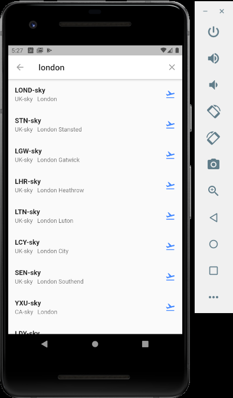
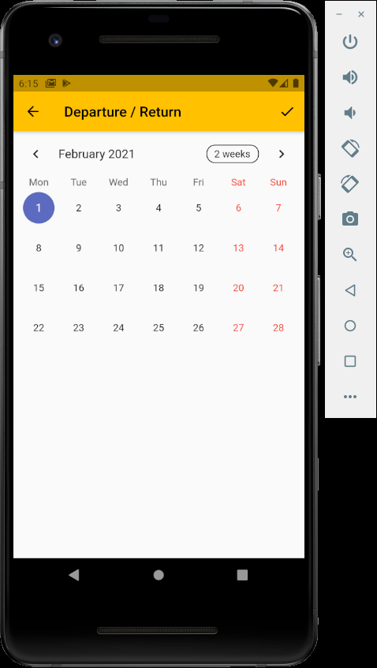
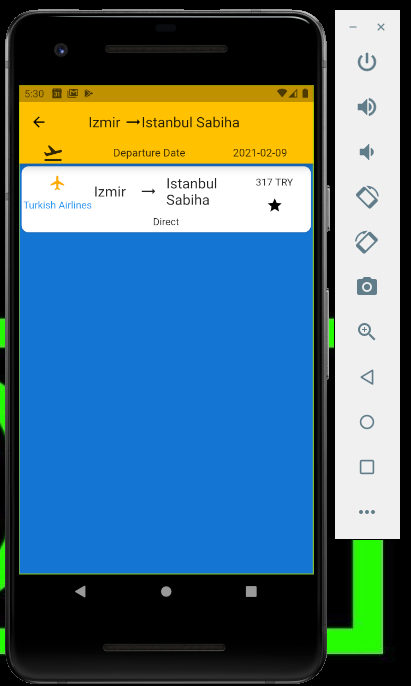
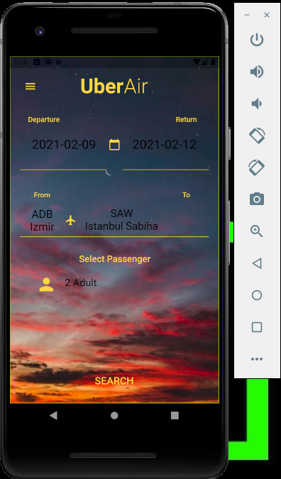
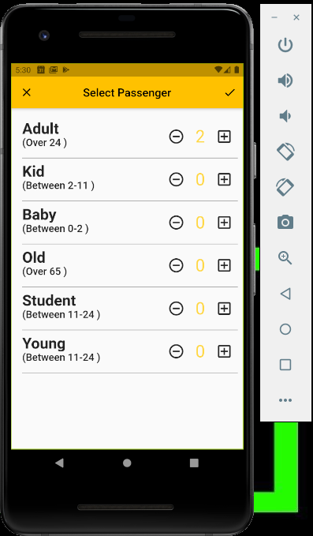

# Uber Air
👉 This is a simple flight booking app build with flutter.

Features 📱

  - Select Date
  - Get airport from skyscanner API
  - Select Passenger
  - Get flights from skyscanner API 
  - Google authentication

Tools 💻

 - <a href="https://flutter.dev/">Flutter</a>

 - <a href="https://code.visualstudio.com/">Vscode</a>

 - <a href="https://www.partners.skyscanner.net/developer-documentation">Skyscanner</a>

 - <a href="https://firebase.google.com/">Firebase</a>
 
 
 
 
 
 

## Getting Started

This project is a starting point for a Flutter application.

A few resources to get you started if this is your first Flutter project:

- [Lab: Write your first Flutter app](https://flutter.dev/docs/get-started/codelab)
- [Cookbook: Useful Flutter samples](https://flutter.dev/docs/cookbook)

For help getting started with Flutter, view our
[online documentation](https://flutter.dev/docs), which offers tutorials,
samples, guidance on mobile development, and a full API reference.
